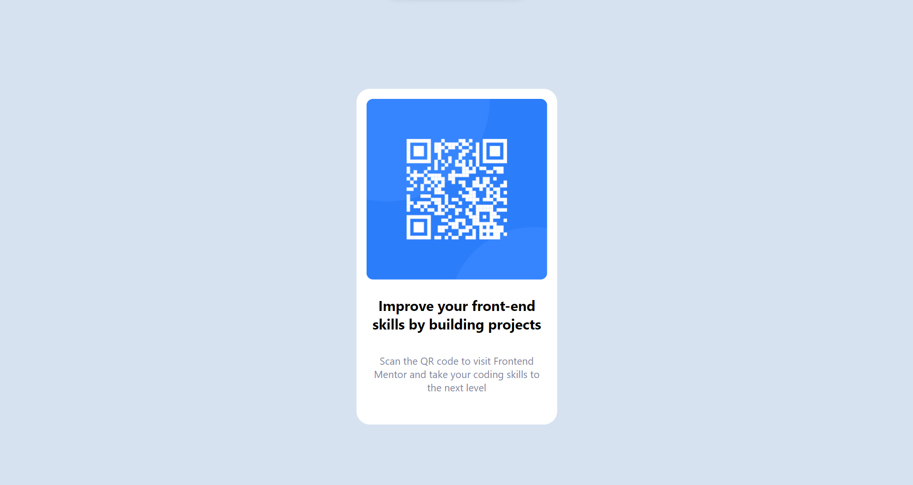

This is a solution to the qr-code-component
## Live site https://abiy5791.github.io/qr-code-component/
## Overview

was a good challenge

## The challenge

i had no clue on how to make the image and the text responsive at the same time

## Screenshot

##Live Site URL

Website https://abiy5791.github.io/status-preview/

##My process

i started from the html and went on up from there everything was going smooth

## Built with

html and css

flexbox

##What i learned

## Author

Website https://abiy5791.github.io/status-preview/ @abiy5791

## Acknowledgments
